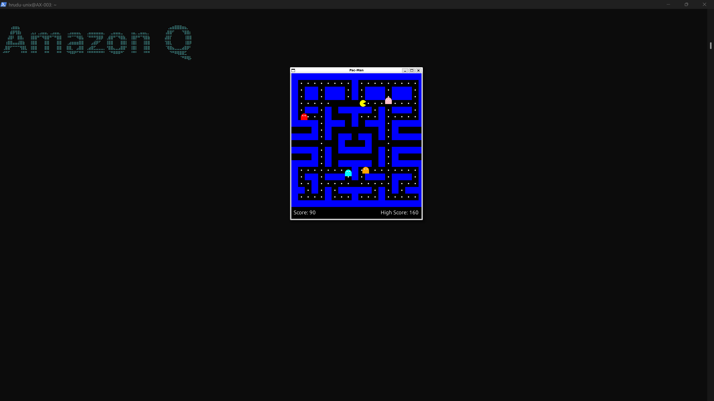
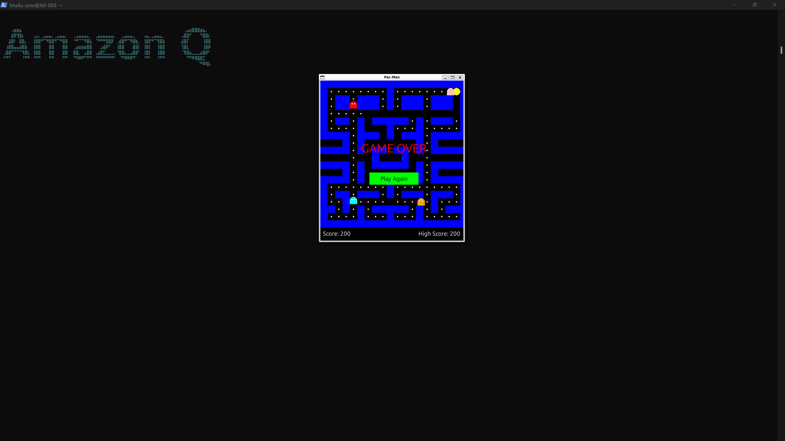

# Pac-Man Game Built with Amazon Q CLI

Welcome to the Pac-Man game enhanced with modern features, developed using Python and Amazon Q CLI. This classic arcade game includes smooth controls, AI ghosts, sound effects, and persistent high score tracking for an engaging experience.

---

## 🎮 Project Overview

This Pac-Man game replicates the iconic maze-chase gameplay with additional features such as:

- Intelligent ghosts with random and reactive movement  
- Pixel-perfect smooth movement and responsive controls  
- Score tracking and a persistent high score saved to disk  
- Play Again button for quick game restarts  
- Sound effects for dot collection and game over  
- Customizable starting position  

Developed iteratively with debugging and enhancements guided by Amazon Q CLI’s code assistance.

---

## 🚀 Features

- **Classic Maze Gameplay:** Navigate the maze, eat dots, avoid ghosts  
- **Ghost AI:** Four colorful ghosts with randomized movement patterns  
- **Smooth Movement:** Grid-based yet smooth pixel movement, with queued direction input  
- **Collision Detection:** Accurate detection prevents passing through walls  
- **Sound Effects:** Feedback sounds for eating dots and being caught  
- **High Score System:** Saves your highest score between sessions in `highscore.txt`  
- **Play Again Button:** Easily restart the game without closing the program  
- **Starting Position:** Pac-Man starts centered in the maze for balanced gameplay  
- **Visual Layout:** Score and high score displayed neatly on the screen  
- **Complete Maze Reset:** All dots reset when a new game begins  

---

## 📸 Screenshots

### Gameplay Screen  
  
*Smooth movement with visible dots and ghosts*

### Game Over with Play Again Button  
  
*After losing, click the green "Play Again" button to restart*

---

## 💻 How to Run

Clone the repository
git clone https://github.com/hrudu-dev/pacman-amazon-qcli.git
cd pacman-amazon-qcli

Create and activate a Python virtual environment (Linux/macOS)
python3 -m venv pacman-env
source pacman-env/bin/activate

For Windows PowerShell, use these commands instead:
python -m venv pacman-env
.\pacman-env\Scripts\Activate.ps1

Install dependencies
pip install pygame

Run the game
python pacman.py

## 🎯 Conclusion

This Pac-Man game built with Amazon Q CLI offers classic arcade fun with modern enhancements like smooth controls, ghost AI, a persistent high score system, and an easy-to-use restart feature. Follow the steps above to quickly set it up and enjoy the gameplay on your machine.

Feel free to explore the code, customize features, or contribute improvements. Happy gaming! 🕹️
